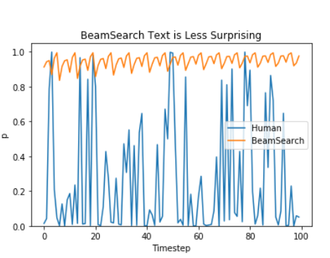
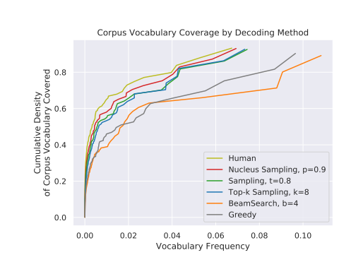

# mmp_sci_diary
Отчетность по спецсеминару

**11.09.2019**

The Curious Case of Neural Text Degeneration
Ari Holtzman, Jan Buys, Maxwell Forbes, Yejin Choi
https://arxiv.org/abs/1904.09751

Основной объект изучения статьи &mdash; проблема **де**генерации текстов. 

Ключевые идеи:
* Генерация текста через максимум правдоподобия имеет тенденцию к дублированию слов и дело вовсе не в том, что задача оптимизации решается неточно(а через Beam Search\Greedy decoding). В статье концентрируют внимание на то, что для следующей последовательности для любого абстрактного токена, такого как "know" характерно поведение ниже. Причем в их исследовании на трансформерах такой эффект достигался для любой начальной строки.

* Разница между распределениями написанного людьми текста и сгенерированного машинного &mdash; существенна. Машинная генерация очень редко уходит в "области с низкой вероятностью" гораздо чаще концентрируясь в самых частотных словах.

* Эти проблемы приводят к тому, чт онеобходим элемент случайности. Например, сэмплирование вместо максимизации, однако такой подход быстро приводит к тому, что текст становится бессвязным илои продолжает быть повторяющимся, просто не настолько примитивно. Авторы приходят к выводу о том, что хвост распределения ненадежен. 
 - Даже одно плохое слово может привести к деградации остальной части;
 - Хотя в хвосте каждое слово имеет крайне маленькую вероятность, но их много.
 
 * Авторы рассматривают известные подходы &mdash; Top-k sampling, и через температуру.
 
 * В статье предложен  подход Top-p sampling(Nucleus sampling), когда распределение обрезается не по фиксированному числу токенов, а тогда когда их суммарная вероятность первосходит некоторый порог (минимальное такое ).
 
 

 
 В отличие от top-k здесь p' будет почти всегда константной. При этом данный подход дает другой уровень контроля над моделью, теперь число семплов из которых мы выбираем меняется динамически, а подбираемый порог имеет прямое отношение к предметной области.

* Проводится сравнение распределений с реальным, по которым предложенный авторами метод превосходит другие.

 
 
 
 